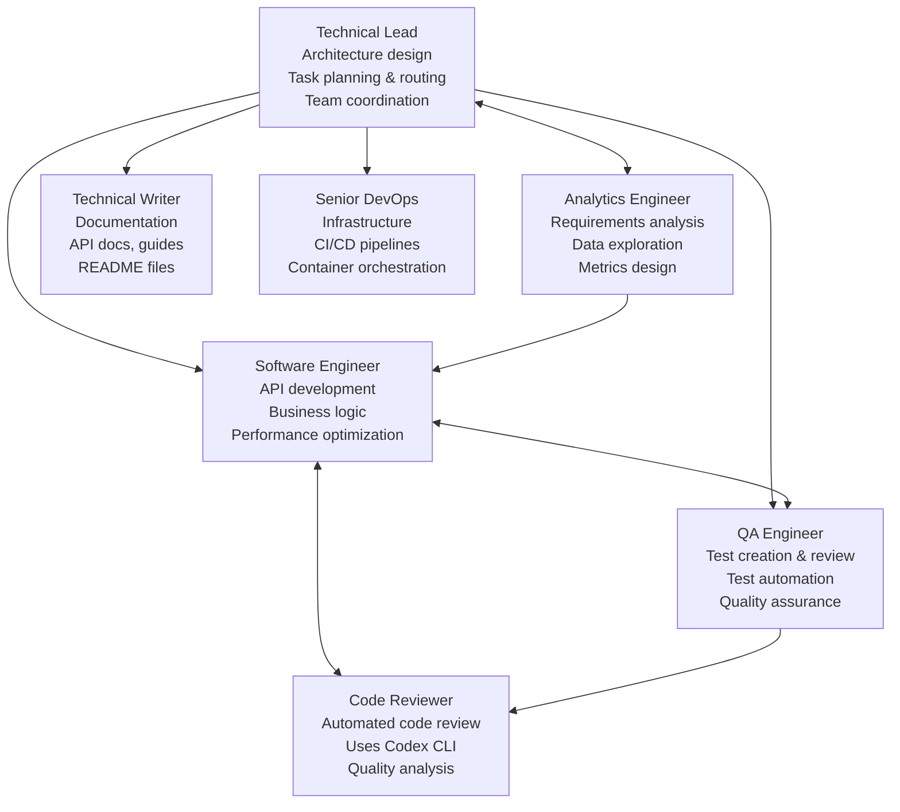
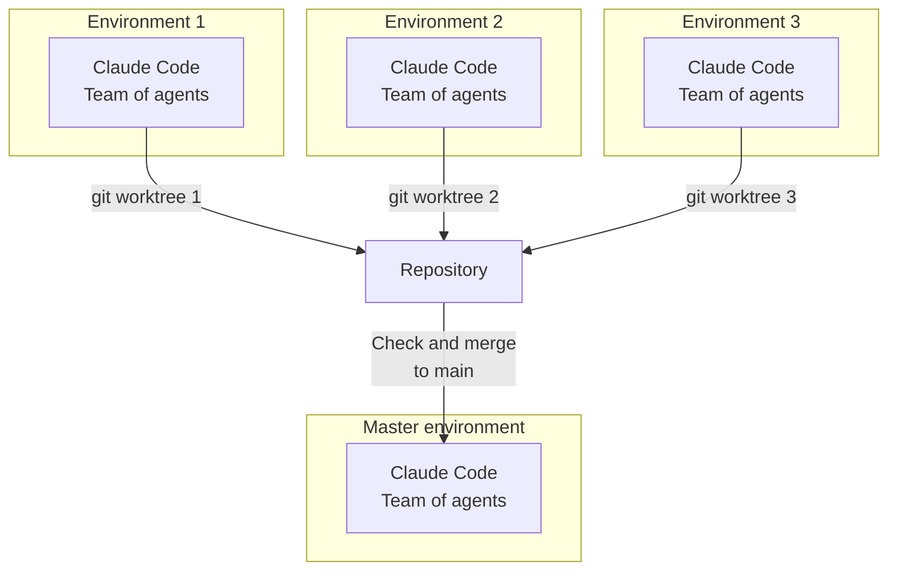

# Architecture — Components & Networks

## AI Agents

Pre-configured agents included in the base image:

```mermaid
flowchart TD
    TL["Technical Lead<br/>Architecture design<br/>Task planning & routing<br/>Team coordination"]

    AN["Analytics Engineer<br/>Requirements analysis<br/>Data exploration<br/>Metrics design"]

    SE["Software Engineer<br/>API development<br/>Business logic<br/>Performance optimization"]

    QA["QA Engineer<br/>Test creation & review<br/>Test automation<br/>Quality assurance"]

    CR["Code Reviewer<br/>Automated code review<br/>Uses Codex CLI<br/>Quality analysis"]

    TW["Technical Writer<br/>Documentation<br/>API docs, guides<br/>README files"]

    DO["Senior DevOps<br/>Infrastructure<br/>CI/CD pipelines<br/>Container orchestration"]

    TL <--> AN
    TL --> SE
    TL --> QA
    SE <--> QA
    SE <--> CR
    TL --> TW
    TL --> DO
    AN --> SE
    QA --> CR
```

## Parallel Tasks — Multi-Environment Workflow

```mermaid
flowchart TD
    subgraph E1 ["Environment 1"]
        CC1["Claude Code<br/>Team of agents"]
    end

    subgraph E2 ["Environment 2"]
        CC2["Claude Code<br/>Team of agents"]
    end

    subgraph E3 ["Environment 3"]
        CC3["Claude Code<br/>Team of agents"]
    end

    subgraph ME ["Master environment"]
        CCM["Claude Code<br/>Team of agents"]
    end

    CC1 -->|git worktree 1| REPO[Repository]
    CC2 -->|git worktree 2| REPO
    CC3 -->|git worktree 3| REPO

    REPO -->|Check and merge<br/>to main| CCM
```